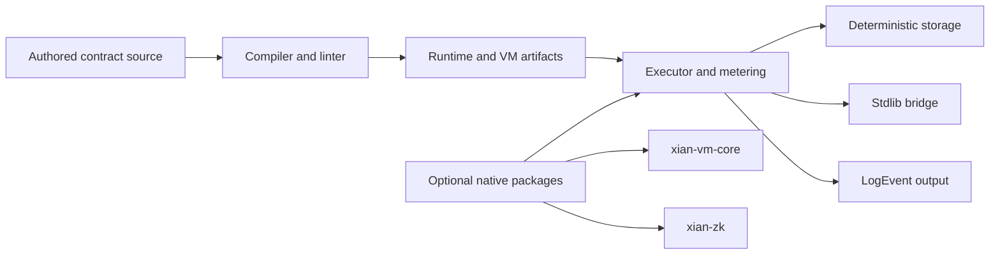

# xian-contracting

`xian-contracting` is the Python smart-contract runtime for Xian. It owns
contract compilation, secure execution, storage semantics, gas metering, the
standard library bridge, and the runtime rules that contracts must obey at
consensus.

The published PyPI package is `xian-tech-contracting`. The import package
remains `contracting`. Side packages under `packages/` (deterministic runtime
types, accounts, native tracer, fast-path validator, VM crates, zk tooling)
are released independently and consumed by `xian-abci`, `xian-py`, and the
node runtime.

## Runtime Shape



## Quick Start

Install the default pure-Python runtime:

```bash
pip install xian-tech-contracting
```

Optional native packages (kept off the default install to keep it small):

```bash
pip install 'xian-tech-contracting[native]'
pip install 'xian-tech-contracting[zk]'
```

Submit a contract and call a method:

```python
from contracting.client import ContractingClient

client = ContractingClient()
client.submit(name="con_token", code=contract_source)

token = client.get_contract("con_token")
token.transfer(amount=100, to="bob")
```

Use the storage driver directly:

```python
from contracting.storage.driver import Driver

driver = Driver()
driver.set("example.key", "value")
print(driver.get("example.key"))
```

## Principles

- **Contracts use Python syntax, but are not general Python.** Execution rules
  are consensus-sensitive and intentionally narrower than the host language.
- **Consensus parity comes first.** Metering, storage encoding, import
  restrictions, and runtime helpers must stay version-aligned across all
  validators.
- **Native acceleration is optional.** The native tracer, fast-path validator,
  and VM crates are implementation details. The contract model and runtime
  rules must remain understandable without them.
- **Stay scoped.** Built-in helpers serve the execution model. They do not grow
  into a general convenience framework.
- **No node orchestration here.** Operator workflow, genesis distribution, and
  container lifecycle belong in `xian-abci`, `xian-cli`, and `xian-stack`.
- **Security-sensitive.** Favor small, well-tested changes. If a fix changes
  execution semantics, add regression tests in the same change.

## Key Directories

- `src/contracting/` — runtime, storage, compilation, and stdlib bridge.
  - `compilation/` — parser, compiler, linter, and whitelist logic.
  - `execution/` — runtime, executor, module loading, and tracing.
  - `storage/` — drivers, ORM helpers, encoder, and LMDB-backed state.
  - `contracts/` — package-local runtime assets (e.g. the built-in submission
    contract).
  - `stdlib/` — contract-side standard-library bridge.
  - `client.py` — high-level `ContractingClient` for tests and tooling.
- `packages/` — independently released sibling packages:
  `xian-accounts`, `xian-contract-tools`, `xian-fastpath-core`,
  `xian-native-tracer`, `xian-runtime-types`, `xian-vm-core`, `xian-zk`.
- `scripts/` — audit and fixture-generation tools used by VM/runtime work.
- `tests/` — `unit/`, `integration/`, `security/`, `performance/` coverage.
- `examples/` — notebook walk-throughs and a non-Jupyter validation script.
- `docs/` — architecture, backlog, current-state notes, and active design drafts.

## What This Runtime Covers

- compilation and linting of contract source
- runtime execution, metering, and import restrictions
- storage drivers and encoding
- contract-side runtime helpers (`stdlib` bridge)
- optional native tracing backend
- speculative parallel batch execution primitives
- native zero-knowledge verifier building blocks
- Xian VM IR generation, validation, parity fixtures, and early native VM work

## Validation

Default CI path (pure-Python, no Rust extensions):

```bash
uv sync --group dev
uv run ruff check .
uv run ruff format --check .
uv run pytest --cov=contracting --cov-report=term-missing --cov-report=xml
```

The default `pytest` config deselects tests marked `optional_native`; those
tests require Rust extension packages that are not part of the pure-Python
install.

Native / release CI path:

```bash
./scripts/validate-release.sh
```

`validate-release.sh` runs the default suite plus the native tracer, zk, and
VM checks, the optional-native parity and fuzz coverage, and the Rust-side
package checks used by release CI. It is the gate for tagging a release.

If you change metering, tracing, storage encoding, or import restrictions,
treat the change as consensus-sensitive and run the relevant `tests/security/`
and `tests/integration/` paths explicitly.

## Related Docs

- [AGENTS.md](AGENTS.md) — repo-specific guidance for AI agents and contributors
- [docs/README.md](docs/README.md) — index of internal design notes
- [docs/ARCHITECTURE.md](docs/ARCHITECTURE.md) — major components and dependency direction
- [docs/BACKLOG.md](docs/BACKLOG.md) — open work and follow-ups
- [docs/SAFETY_INVARIANTS.md](docs/SAFETY_INVARIANTS.md) — invariants the runtime must preserve
- [docs/PARALLEL_EXECUTION.md](docs/PARALLEL_EXECUTION.md) — speculative parallel batch execution model
- [docs/TRACER_BACKENDS.md](docs/TRACER_BACKENDS.md) — Python vs. native tracer backends
- [docs/COMPILE_TIME_EXTENDS.md](docs/COMPILE_TIME_EXTENDS.md) — contract import / extends model
- [docs/EXECUTION_BACKLOG.md](docs/EXECUTION_BACKLOG.md) — execution-engine follow-ups
- [docs/SHIELDED_STATE_REDESIGN_V2.md](docs/SHIELDED_STATE_REDESIGN_V2.md) — shielded-state model
- [docs/ZK_PRIVACY_OPTIMIZATION_PLAN.md](docs/ZK_PRIVACY_OPTIMIZATION_PLAN.md) — zk privacy roadmap
