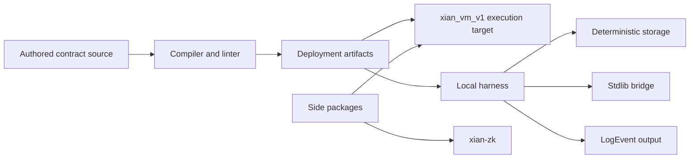

# xian-contracting

`xian-contracting` is the contract compiler, artifact builder, local test
harness, and standard-library bridge for Xian. Network execution is defined by
the Xian VM (`xian_vm_v1`).

The published PyPI package is `xian-tech-contracting`. The import package
remains `contracting`. Side packages under `packages/` (deterministic runtime
types, accounts, fast-path validator, VM crates, zk tooling)
are released independently and consumed by `xian-abci`, `xian-py`, and the
node runtime.

## Package Shape



## Quick Start

Install the package:

```bash
uv add xian-tech-contracting
```

Optional zk helpers are kept off the default install:

```bash
uv add 'xian-tech-contracting[zk]'
```

Compile deployment artifacts:

```python
from contracting.artifacts import build_contract_artifacts

artifacts = build_contract_artifacts(
    module_name="con_token",
    source=contract_source,
)
```

Run a contract in the local harness:

```python
from contracting.local import ContractingClient

client = ContractingClient()
client.submit(contract_source, name="con_token")

token = client.get_contract_proxy("con_token")
token.transfer(amount=100, to="bob")
```

`submit(...)` accepts contract source as a string or a Python function whose
body is the contract.

Use the storage driver directly:

```python
from contracting.storage.driver import Driver

driver = Driver()
driver.set("example.key", "value")
print(driver.get("example.key"))
```

## Principles

- **Contracts use Python syntax, but are not general Python.** Execution rules
  are consensus-sensitive and intentionally narrower than the host language.
- **Consensus parity comes first.** Metering, storage encoding, import
  restrictions, and runtime helpers must stay version-aligned across all
  validators.
- **The Xian VM is the execution target.** The local harness is for contract
  tests and developer ergonomics; the deployable artifact is source plus Xian
  VM IR.
- **Compiler and harness stay distinct.** SDKs and CLI deployment flows consume
  deployment artifacts. The local harness may derive transient proxies for
  testing, but those are not chain artifacts.
- **Stay scoped.** Built-in helpers serve the execution model. They do not grow
  into a general convenience framework.
- **No node orchestration here.** Operator workflow, genesis distribution, and
  container lifecycle belong in `xian-abci`, `xian-cli`, and `xian-stack`.
- **Security-sensitive.** Favor small, well-tested changes. If a fix changes
  execution semantics, add regression tests in the same change.

## Key Directories

- `src/contracting/` — compiler, artifacts, local harness, storage, and stdlib
  bridge.
  - `artifacts/` — public deployment artifact builder and validator.
  - `compilation/` — parser, compiler, linter, and whitelist logic.
  - `compiler/` — public compiler import surface.
  - `execution/` — runtime, executor, module loading, and tracing.
  - `local/` — high-level `ContractingClient` for local tests and tooling.
  - `storage/` — drivers, ORM helpers, encoder, and LMDB-backed state.
  - `contracts/` — package-local contract assets (e.g. the built-in submission
    contract).
  - `stdlib/` — contract-side standard-library bridge.
- `packages/` — independently released sibling packages:
  `xian-accounts`, `xian-compiler-core`, `xian-contract-tools`,
  `xian-fastpath-core`, `xian-native-tracer`,
  `xian-runtime-types`, `xian-vm-core`, `xian-zk`.
- `scripts/` — audit and fixture-generation tools used by VM/runtime work.
- `tests/` — `unit/`, `integration/`, `security/`, `performance/` coverage.
- `examples/` — notebook walk-throughs and a non-Jupyter validation script.
- `docs/` — architecture, backlog, current-state notes, and active design drafts.

## What This Runtime Covers

- compilation and linting of contract source
- local harness execution, metering, and import restrictions
- storage drivers and encoding
- contract-side runtime helpers (`stdlib` bridge)
- speculative parallel batch execution primitives
- native zero-knowledge verifier building blocks
- Xian VM IR generation, validation, parity fixtures, and early native VM work

## Validation

Default CI path (pure-Python, no Rust extensions):

```bash
uv sync --group dev
uv run ruff check .
uv run ruff format --check .
uv run pytest --cov=contracting --cov-report=term-missing --cov-report=xml
```

The default `pytest` config deselects tests marked `optional_native`; those
tests require heavier Rust extension packages beyond the required compiler
core.

Native / release CI path:

```bash
./scripts/validate-release.sh
```

`validate-release.sh` runs the default suite plus compiler-core, zk, and VM
checks, the WASM compiler package build, optional-native parity and fuzz
coverage, and the Rust-side package checks used by release CI. It is the gate
for tagging a release.

If you change metering, tracing, storage encoding, or import restrictions,
treat the change as consensus-sensitive and run the relevant `tests/security/`
and `tests/integration/` paths explicitly.

## Related Docs

- [AGENTS.md](AGENTS.md) — repo-specific guidance for AI agents and contributors
- [docs/README.md](docs/README.md) — index of internal design notes
- [docs/ARCHITECTURE.md](docs/ARCHITECTURE.md) — major components and dependency direction
- [docs/BACKLOG.md](docs/BACKLOG.md) — open work and follow-ups
- [docs/COMPILER_RELEASE.md](docs/COMPILER_RELEASE.md) — compiler package validation and publish order
- [docs/SAFETY_INVARIANTS.md](docs/SAFETY_INVARIANTS.md) — invariants the runtime must preserve
- [docs/PARALLEL_EXECUTION.md](docs/PARALLEL_EXECUTION.md) — speculative parallel batch execution model
- [docs/COMPILE_TIME_EXTENDS.md](docs/COMPILE_TIME_EXTENDS.md) — contract import / extends model
- [docs/EXECUTION_BACKLOG.md](docs/EXECUTION_BACKLOG.md) — execution-engine follow-ups
- [docs/SHIELDED_STATE_REDESIGN_V2.md](docs/SHIELDED_STATE_REDESIGN_V2.md) — shielded-state model
- [docs/ZK_PRIVACY_OPTIMIZATION_PLAN.md](docs/ZK_PRIVACY_OPTIMIZATION_PLAN.md) — zk privacy roadmap
