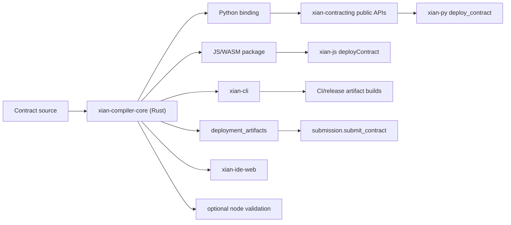

# Central Rust/WASM Compiler Architecture

This document defines the target architecture for contract compilation after the
move to `xian_vm_v1` as the only network execution mode.

The decision: Xian should have one authoritative compiler core. SDKs, the CLI,
the browser IDE, CI, and optional node-side validation should all call that same
core through thin language bindings. The compiler core should be written in Rust
and packaged for native Python, native/Node JavaScript, and browser WASM.

## Goals

- Make `source -> normalized source -> xian_vm_v1 IR -> deployment_artifacts`
  one canonical implementation.
- Keep the deployment artifact contract stable:
  - `format = xian_contract_artifact_v1`
  - `module_name`
  - `vm_profile = xian_vm_v1`
  - `source`
  - `vm_ir_json`
  - `hashes.source_sha256`
  - `hashes.vm_ir_sha256`
- Give every public surface the same compiler behavior:
  - `contracting.artifacts.build_contract_artifacts(...)`
  - `xian-py deploy_contract(name, source, ...)`
  - `xian-js deployContract({ name, source, ... })`
  - `xian contract build-artifacts ...`
  - `xian-ide-web` lint/diagnostics/deploy
  - optional node-side `source -> IR` validation
- Keep compiler output reproducible across operating systems, CPU
  architectures, Python versions, Node versions, and browsers.
- Remove the Python compiler after the Rust compiler is authoritative; do not
  keep two production compilers.

## Non-Goals

- Do not revive the Python VM.
- Do not implement a separate JavaScript compiler.
- Do not compile contracts inside validators as part of normal execution.
- Do not make arbitrary CPython behavior the language spec. Xian contracts are a
  deterministic Python-like subset owned by Xian.
- Do not change the deployment transaction shape just because compiler
  packaging changes. The protocol continues to accept deployment artifacts.

## Current State

The current production compiler path is the Rust `xian-compiler-core` package
under `packages/xian-compiler-core/`, with Python bindings consumed by
`contracting.artifacts`.

Current behavior:

- parses source through `rustpython-parser`
- normalizes source with Xian-owned Rust formatting
- runs lint and VM compatibility checks
- lowers accepted source to canonical `xian_vm_v1` JSON IR
- builds `xian_contract_artifact_v1` deployment artifacts
- validates artifact shape, hashes, normalized source, and canonical compiler
  output before deployment

The old Python compiler remains only as a parity oracle while the Rust compiler
is being integrated into all consumers.

The Python SDK can deploy from source because it depends on
`xian-tech-contracting`. The JavaScript SDK can deploy from source when
`@xian-tech/compiler` is installed or injected. The browser IDE builds and
deploys artifacts through the same WASM package and renders structured compiler
diagnostics in Monaco.

## Target Topology



## Package Layout

Recommended first layout inside `xian-contracting`:

- `packages/xian-compiler-core/`
  - Rust library crate.
  - Owns parser, normalizer, diagnostics, lowerer, artifact builder, and
    source/IR/hash validation.
  - No filesystem, network, wall-clock time, randomness, or host callbacks.
- `packages/xian-vm-core/`
  - Continues to own VM execution and artifact/IR structural validation.
  - May share schema constants with compiler core. If sharing grows, extract a
    tiny `xian-contract-schema` crate instead of creating circular ownership.
- `packages/xian-compiler-core/python/`
  - PyO3/maturin binding published as an importable native module.
  - `contracting.artifacts` delegates here once parity is proven.
- `packages/xian-compiler-core/npm/`
  - WASM package published as `@xian-tech/compiler`.
  - Browser and Node entrypoints use the same compiled core.

The public package names can be adjusted before release, but the ownership
boundary should stay: compiler core owns compilation; SDKs only adapt inputs and
outputs.

### Core Module Boundaries

The Rust core should stay small by keeping each layer explicit:

- `source`: immutable `module_name + source + vm_profile` input units.
- `diagnostic`: stable structured diagnostics used by IDEs, SDKs, and tests.
- `artifact`: `xian_contract_artifact_v1` builder/validator, hash rules, and
  IR identity checks.
- `fixture`: executable compiler-spec records generated from the current Python
  compiler and consumed by the Rust test suite.
- `compiler`: SDK-facing options, diagnostics entrypoint, and version metadata.
- `frontend`: deterministic parser adapter and syntax diagnostics for the Xian
  contract language subset. The first implementation uses `rustpython-parser`
  behind an opaque `ParsedModule` type so SDK APIs do not depend on that crate.
- `syntax`: compact Xian-owned syntax tree plus conversion diagnostics. It
  accepts only the Xian contract subset that later lint, normalization, and
  lowering stages should understand.
- `lint`: semantic rules over `SyntaxModule`, including decorators, exported
  function signatures, ORM assignment invariants, restricted names, imports, and
  disallowed builtins.
- `normalize`: deterministic canonical source formatting over `SyntaxModule`,
  independent of Python, Node, browser, OS, or locale.
- `lower`: `SyntaxModule`-to-`xian_ir_v1` lowering, host dependency discovery,
  and structural artifact payload generation with bounded host-surface metadata.

The first implementation slice deliberately avoids a temporary hand-written
parser. RustPython gives us a real Python grammar now, while the opaque parsed
module keeps that choice replaceable if dependency size or grammar control later
argues for an in-house parser.

## Public APIs

The Rust core should expose these logical operations. Bindings should preserve
the same names and data shapes where language conventions allow it.

```text
build_contract_artifacts(module_name, source, options) -> artifact
validate_contract_artifacts(module_name, artifact, options) -> validated_artifact
diagnose_contract(module_name, source, options) -> diagnostics
normalize_source(module_name, source, options) -> normalized_source
lower_source_to_ir(module_name, source, options) -> vm_ir
lower_source_to_ir_json(module_name, source, options) -> vm_ir_json
describe_vm_host_surface() -> host catalog metadata
compiler_version() -> version metadata
```

Options:

- `vm_profile`: only `xian_vm_v1` initially.
- `lint`: default `true`.
- `diagnostic_format`: default stable machine-readable diagnostics.
- `limits`: optional source size / AST node / lowering step caps for tooling.

Diagnostics must be deterministic and structured:

```json
{
  "severity": "error",
  "code": "xian.syntax.unsupported_lambda",
  "message": "lambda expressions are not supported",
  "range": {
    "start_line": 12,
    "start_column": 8,
    "end_line": 12,
    "end_column": 24
  }
}
```

The browser IDE should use diagnostics directly for editor markers instead of
parsing exception strings.

## SDK And Tooling Integration

### Python

`xian-tech-contracting` remains the public Python import surface:

```python
from contracting.artifacts import build_contract_artifacts
```

`xian-tech-contracting` delegates artifact builds to the Rust binding.
`xian-py deploy_contract(...)` remains a thin convenience wrapper:

1. call `build_contract_artifacts`
2. call `submit_contract(name, artifacts, args=...)`

### JavaScript

Add a compiler package used by both SDK and browser apps:

```ts
import { buildContractArtifacts } from "@xian-tech/compiler";

const artifacts = await buildContractArtifacts({
  moduleName: "con_counter",
  source,
  lint: true
});
```

Then `xian-js` can expose:

```ts
await client.deployContract({
  name: "con_counter",
  source,
  args: {},
  signer
});
```

Internally this compiles to artifacts and then calls the existing
artifact-backed submission path. `submitContract({ deploymentArtifacts })`
should remain for CI and advanced workflows that build artifacts elsewhere.

### CLI

`xian contract build-artifacts` remains the offline artifact builder.

`xian client tx submit-artifacts` remains the signed network submitter.

When the Rust compiler becomes authoritative, the CLI should get the new
compiler behavior by dependency upgrade, not by implementing compiler logic in
`xian-cli`.

### xian-ide-web

The IDE imports `@xian-tech/compiler` directly:

1. the check action calls `diagnoseContractJson`
2. compile/deploy calls `compileContractArtifactJson`
3. wallet submission sends `deployment_artifacts`
4. diagnostics are rendered from structured ranges

Deployment and compiler-backed diagnostics are implemented. A visible compiler
provenance/debug surface remains optional follow-up IDE work.

### Nodes

Nodes should keep accepting deployment artifacts. Optional validation can use
the same Rust core to prove submitted `source` produces submitted `vm_ir_json`.

That validation should be bounded and explicit. It is an admission/deployment
check, not contract execution.

## Determinism Requirements

- Canonical JSON output must use one stable key ordering and whitespace policy.
- Hashes must be computed from canonical source and canonical IR bytes.
- No behavior may depend on locale, current time, host filesystem, environment
  variables, Python version, Node version, browser engine, or OS path rules.
- Compiler diagnostics must be stable enough for tests and IDE markers.
- Resource limits must produce deterministic errors instead of panics or host
  crashes.

## Migration Plan

1. Freeze the artifact contract.
   - Document exact required fields and canonical JSON settings.
   - Keep `xian_contract_artifact_v1` stable during migration.

2. Build an executable compiler spec.
   - Add a fixture format that stores input source, expected normalized source,
     expected `vm_ir_json`, expected hashes, diagnostics, and rejection reason.
   - Generate fixtures from the current Python compiler.
   - Include authored contracts from core, configs, DEX, stable protocol,
     shielded flows, governance, token factory, and small language probes.

3. Implement Rust compiler core behind the fixtures.
   - Start with parser, diagnostics, normalization, then lowering.
   - Use the current Python compiler only as the parity oracle during migration.
   - Require byte-identical artifacts before switching authority.

4. Add bindings.
   - Python binding through PyO3/maturin.
   - Browser/Node package through WASM.
   - Keep binding layers thin and test them against the same fixture corpus.

5. Integrate consumers.
   - `contracting.artifacts` delegates to Rust. Done.
   - `xian-py deploy_contract` stays unchanged externally. Done.
   - `xian-js deployContract` becomes available. Initial SDK surface done.
   - `xian-ide-web` compiles with browser-local WASM and deploys artifacts. Done.
   - `xian-cli` builds artifacts through the same public API. Done.

6. Switch authority and remove the old compiler.
   - Rust output becomes canonical.
   - Python compiler implementation is deleted or retained only as archived
     migration fixtures.
   - Five-node E2E deployments must pass using Rust-built artifacts before this
     step is complete.

## Validation Gates

The Rust compiler core should not become authoritative until:

- the full fixture corpus is byte-identical for accepted contracts
- rejected contracts produce stable diagnostics
- Python and JS bindings produce identical artifacts for the same input
- `xian-cli` can build and submit artifacts produced by the Rust core
- `xian-ide-web` can compile in browser and deploy via wallet provider
- node-side artifact validation accepts artifacts from both bindings
- five-node E2E deployment flows pass with Rust-built artifacts

## Risks And Decisions

- Parser choice is the biggest early decision. Reusing a Rust Python parser may
  speed up migration, but the accepted language must still be Xian-owned and
  explicitly restricted.
- Source normalization must be frozen before authority switches. Matching
  CPython `ast.unparse` forever is not a good long-term spec.
- WASM package size and initialization time matter for `xian-ide-web`; the core
  should stay dependency-light.
- Node validation adds security value but costs deployment admission time. It
  should be measured behind limits before becoming mandatory.
- Keeping the Python compiler after the switch would recreate the dual-compiler
  complexity this design is meant to remove.

## First Implementation Slice

Do not begin by rewriting the whole compiler.

The first slice should be:

1. define the compiler fixture JSON schema
2. add a command to generate fixtures from the current Python compiler
3. add Rust test scaffolding that reads those fixtures
4. implement enough Rust parser/lowerer behavior to pass the smallest fixtures
5. add WASM packaging only after the core test harness is credible

That makes the current compiler behavior executable and gives the Rust rewrite a
clear definition of done.

The first fixture/spec slice lives in:

- `docs/compiler_fixture_v1.schema.json`
- `scripts/generate_compiler_fixtures.py`
- `src/contracting/compiler/fixtures.py`
- `packages/xian-compiler-core/`
