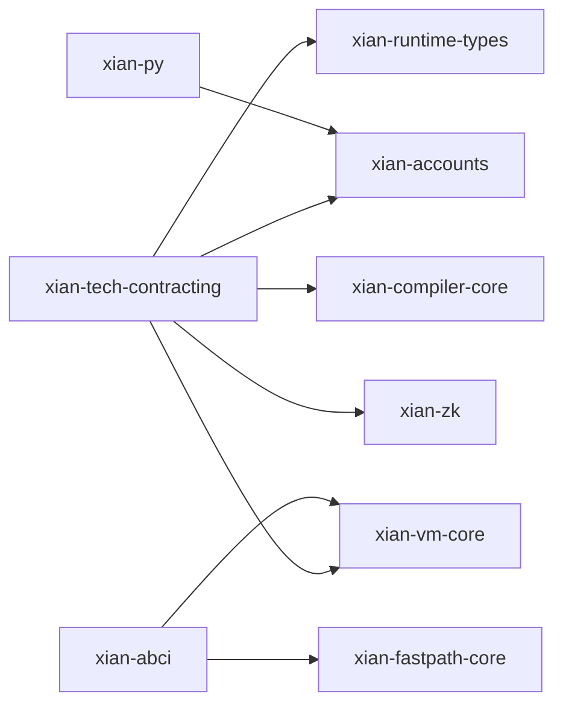

# Packages

This folder contains smaller publishable packages shared by the Xian runtime
and node stack. They stay separate so `xian-tech-contracting` can depend on
small, purpose-built packages instead of growing one monolithic runtime.

## Contents

- `xian-runtime-types/`: deterministic shared value types and encoding
- `xian-accounts/`: shared signing and account primitives
- `xian-compiler-core/`: shared Rust/WASM compiler core, published as
  `xian-tech-compiler-core`
- `xian-fastpath-core/`: optional native fast paths for transaction admission,
  published as `xian-tech-fastpath-core`
- `xian-vm-core/`: native `xian_ir_v1` validation and early VM execution work,
  published as `xian-tech-vm-core`
- `xian-zk/`: native Groth16 BN254 verification and shielded-note proving
  toolkit, published as `xian-tech-zk`

## Notes

Keep these packages small and purpose-built. Shared code belongs here only when
it has a clear runtime/node boundary and an independent package surface.
