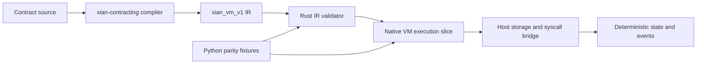

# xian-vm-core

`xian-vm-core` is the Rust-side consumer of the frozen `xian_vm_v1` compiler IR
emitted by `xian-contracting`.

Supported scope:

- deserialize the structural JSON IR
- validate its top-level invariants and recursive node shapes
- instantiate validated modules and execute a direct-IR interpreter slice
- provide one Rust-owned contract for the Python frontend to target
- expose a minimal Python-facing native capability surface for `xian-abci`
  probing via `xian_vm_core._native`

Execution coverage is intentionally narrow but real:

- local function calls and builtin calls such as `len`, `range`, `str`, and
  `isinstance`
- aggregate/container helpers such as `sorted`, `sum`, `min`, `max`, `all`,
  `any`, `reversed`, and `zip`
- explicit storage ops for `Variable` and `Hash`
- foreign storage reads for `ForeignVariable` and `ForeignHash`
- arbitrary-precision integer values instead of `i64`-only VM integers
- fixed-precision `decimal(...)` construction and arithmetic
- native `datetime.datetime` / `datetime.timedelta` values, including
  `datetime.datetime.strptime(...)`, arithmetic, comparison, and common field
  access
- bigint-oriented builtins needed by the shielded contracts, including
  `int(..., base)`, `pow(base, exp, mod)`, and `format(value, "064x")`
- `hashlib.sha3(...)` and `hashlib.sha256(...)`
- `crypto.verify(...)` and `crypto.key_is_valid(...)`
- `LogEvent` emission
- static-import and dynamic-import contract export calls
- native container method calls used by contracts today, including
  `dict.keys()`, `dict.values()`, `dict.items()`, `dict.get()`, and the common
  mutable list helpers `append`, `extend`, `insert`, `remove`, and `pop`
- native string helpers used by the shielded contracts, including
  `lower()`, `isalnum()`, `startswith(...)`, and `join(...)`
- Python-style subscript slicing for `list`, `tuple`, and `str`, including
  the `value[2:]` helper pattern used in the shielded contracts
- sequence repetition for `list`, `tuple`, and `str`
- host-delegated `zk.*` syscalls, which remain explicit runtime boundary calls
  instead of Rust-local protocol logic

It is a bounded execution slice, not the full executor.

The crate includes curated conformance fixtures generated from the current local
harness. Those fixtures are checked from Rust so the VM can match actual
contract behavior on a controlled contract subset alongside hand-written
executor tests.

Metering covers both host-side data costs and VM execution:

- storage reads, writes, transaction bytes, and return-value bytes are charged
  directly in the VM host path
- execution cost is driven by an explicit `xian_vm_v1` gas schedule over VM
  statements, expressions, calls, and loop iterations
- module initialization is metered, so first-load authored contracts do not get
  free global-declaration and module-body execution
- `contract.exists(...)`, `contract.has_export(...)`, `contract.info(...)`, and
  related contract metadata syscalls resolve directly against the driver/IR in
  the native host bridge
- authored contract storage persists `__xian_ir_v1__`, and the native host
  requires that artifact for `xian_vm_v1` execution; stored `__source__` remains
  available for dashboards, BDS, and other inspection tooling
- the VM-native artifact path treats `vm_ir_json` as the only executable
  deployment artifact; local tooling may derive transient harness source when
  it needs a standalone contract proxy
- deployment artifacts are validated against canonical compiler output, not only
  against self-declared hashes, so forged source/IR bundles are rejected before
  they reach native deployment
- native deployment requires explicit deterministic `now` context from the
  caller; the host does not fall back to local wall-clock time for submission
  metadata
- the native deployment path validates bundle shape, hashes, and IR/source
  linkage in Rust before staging writes or executing constructors
- the Python deployment path and offline tooling keep canonical
  source-to-runtime recompilation in the Python artifact validator; the native
  path is Rust-native for bundle validation, not a Rust recompiler
- the five-node `make localnet-parallel-e2e` native-authority soak passes end to
  end, including shielded token flows and parallel prefix-scan access patterns

That parity corpus covers:

- storage/event flows
- range/list/dict control-flow helpers
- foreign storage reads
- fixed-precision decimal semantics
- datetime/timedelta behavior
- bigint parsing, modular arithmetic, hex formatting, and shielded-style helper
  flows
- hashing and ed25519 verification helpers
- static-import and dynamic-import nested contract calls
- real authored shielded contract sources for `shielded-note-token` and
  `shielded-commands`, including constructor-seeded state snapshots and
  hash-helper exports
- real authored token, registry, game, and oracle flows across repos, including:
  `currency.transfer(...)`, `stable_token.burn(...)`,
  `reflection_token.transfer(...)`, `profile_registry.create_channel(...)`,
  `turn_based_games.join_match(...)`, and `oracle.price_info(...)`

The intent is to keep the Xian VM implementation Rust-first for performance,
while still freezing semantics in the Python compiler frontend before runtime
execution work starts.

The crate ships a small PyO3/maturin surface for integration work:

- `runtime_info()` / `runtime_info_json()`
- `supports_execution_policy(...)`
- `validate_module_ir(...)` / `validate_module_ir_json(...)`

That surface is intentionally narrow. It is there so node-side code can probe
the VM runtime honestly before transaction execution is wired through the Rust
engine.

The largest remaining runtime work is metering drift on the heaviest authored
flows and the host-operation split between delegated calls and Rust-owned
implementations. Integer width, basic authored shielded execution, and
pre-call setup flows are covered by the authored parity corpus and fixture
generator.
