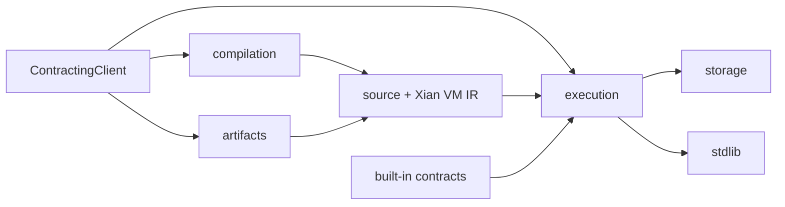

# contracting

This package is the core Xian contract toolkit. It compiles authored contract
source, builds source-plus-IR deployment artifacts, provides the local test
harness, manages contract storage, and exposes the contract-side stdlib bridge.

## Contents

- `artifacts/`: public deployment artifact builder and validator
- `compiler/`: public compiler import surface
- `local/`: `ContractingClient` facade used by tests, tools, and local callers
- `compilation/`: linter, compiler internals, conformance checks, and
  `xian_ir_v1` lowering
- `execution/`: runtime context, executor, restricted imports, local tracing,
  and speculative parallel batch primitives
- `storage/`: LMDB-backed driver, contract storage helpers, and ORM objects
- `stdlib/`: deterministic builtins and bridge modules exposed to contracts
- `contracts/`: built-in submission contract source and bundled assets
- `constants.py` and `names.py`: shared runtime constants and contract-name
  validation

## Notes

This package is consensus-sensitive. Changes to compilation output, metering,
storage encoding, import restrictions, event semantics, or stdlib behavior can
be protocol-affecting and need targeted regression coverage.
