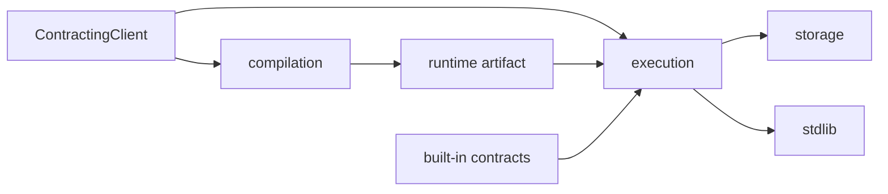

# contracting

This package is the core Xian contract engine. It compiles authored contract
source, executes contracts with deterministic runtime rules, manages contract
storage, and exposes the contract-side stdlib bridge.

## Contents

- `client.py`: `ContractingClient` facade used by tests, tools, and local
  callers
- `compilation/`: linter, compiler, artifact builder, VM compatibility checks,
  and `xian_ir_v1` lowering
- `execution/`: runtime context, executor, restricted imports, tracer backends,
  and speculative parallel batch primitives
- `storage/`: LMDB-backed driver, contract storage helpers, and ORM objects
- `stdlib/`: deterministic builtins and bridge modules exposed to contracts
- `contracts/`: built-in submission contract runtime/source assets
- `constants.py` and `names.py`: shared runtime constants and contract-name
  validation

## Notes

This package is consensus-sensitive. Changes to compilation output, metering,
storage encoding, import restrictions, event semantics, or stdlib behavior can
be protocol-affecting and need targeted regression coverage.
